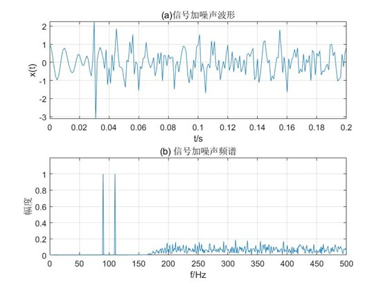
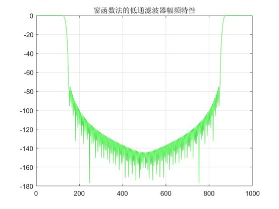
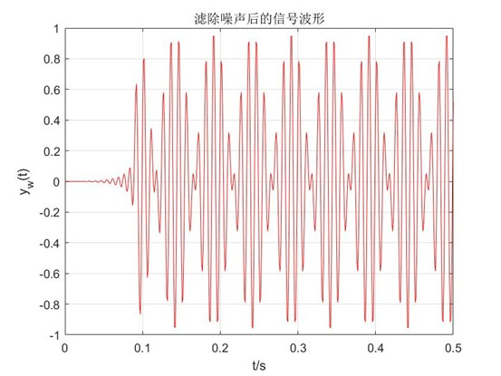
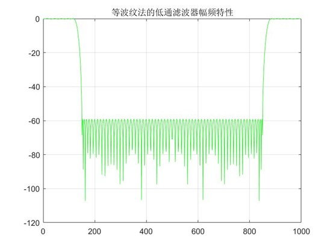
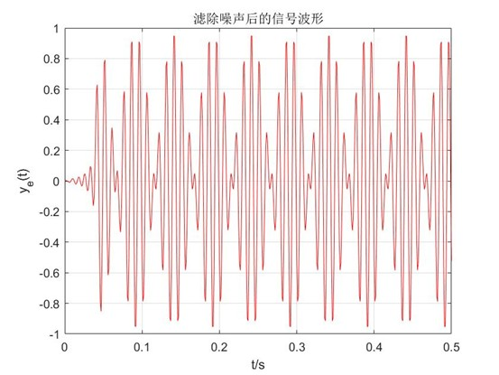
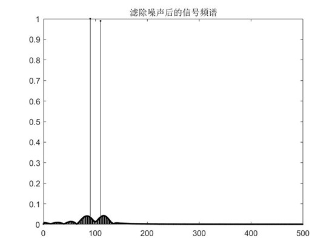

# FIR数字滤波器设计及软件实现

一个基于MATLAB的小型信号处理项目：从含噪声的单频调幅（AM）信号中，用两种经典方法设计FIR低通滤波器并提取出原始信号，同时对比两种设计方法的性能差异。项目源自课程实验，现已重构为可复用、模块化的个人项目。

## 项目背景

在实际信号采集中，有用信号常常被高频噪声污染。本项目模拟了这一场景：构造一个被高频噪声叠加的单频调幅信号，并设计低通FIR滤波器将噪声滤除、还原出原始信号。项目分别采用**窗函数法**（Blackman窗）和**等波纹最佳逼近法**（Parks-McClellan/Remez算法）设计滤波器，并比较两者在滤波器阶数、运算量和时延上的差异。

## 最终成果

程序成功从被高频噪声污染的信号中恢复出了原始的单频调幅信号，两种设计方法均达到了预期的滤波指标（通带最大衰减<0.2dB，阻带最小衰减>60dB）：

- 恢复信号的频谱在90Hz和110Hz处出现两条清晰谱线（对应载波频率100Hz±调制频率10Hz），噪声成分被有效抑制，验证了滤波器设计正确。
- **等波纹法**（阶数83）相比**窗函数法**（阶数184）所需阶数减少约55%，在恢复信号波形中体现为更短的建立时延（约0.02–0.04s起振稳定，而窗函数法约需0.1s），印证了等波纹法在同等指标下运算量和时延更低的结论。
- 两种方法设计的滤波器阻带衰减均达标，但窗函数法阻带衰减存在明显冗余（远高于60dB要求），等波纹法则严格贴合60dB指标，指标利用更充分。

### 原始噪声信号



*含高频噪声的调幅信号：时域波形（上）呈现被噪声污染的振荡形态；频谱（下）显示90/110Hz 处的有用信号谱线，以及150Hz以上的宽带噪声。*

### 窗函数法（Blackman）设计结果



*窗函数法（阶数184）的幅频特性：过渡带较陡，但阻带衰减在远离截止频率处远超60dB要求，存在指标冗余。*



*滤波后信号 \(y_w(t)\)：噪声被有效滤除，但由于滤波器阶数较高，起振建立时延明显（约0.1s后波形趋于稳定）。*

### 等波纹最佳逼近法（Remez）设计结果



*等波纹法（阶数83）的幅频特性：通带和阻带均呈现均匀的等波纹分布，阻带衰减严格贴合60dB指标，无明显冗余。*



*滤波后信号 \(y_e(t)\)：波形恢复更快（约0.02–0.04s即趋于稳定），时延明显低于窗函数法。*



*滤波后信号频谱：在90Hz和110Hz处清晰恢复出两条谱线（幅度归一化为1），高频噪声被压制在基线附近（<0.03），验证滤波效果良好。*

## 功能特性

- 生成带高频噪声的单频调幅测试信号，并可视化其时域波形与频谱
- 基于`fir1`+Blackman窗设计线性相位FIR低通滤波器
- 基于`remezord`+`remez`设计等波纹最佳逼近FIR低通滤波器
- 使用`fftfilt`快速卷积实现对测试信号的滤波
- 绘制滤波器幅频特性曲线、滤波后信号的时域波形和频谱
- 自动比较两种方法所需的滤波器阶数

## 环境依赖

- MATLAB
- Signal Processing Toolbox（提供`fir1`、`remez`、`remezord`、`fftfilt`、`blackman`等函数）

> 注：`remezord`在较新版本 MATLAB 中可能需要Signal Processing Toolbox的旧版兼容支持；若函数不存在，可用`firpmord`替代，用法基本一致。

## 使用方法

1. 将全部`.m`文件放入同一文件夹（或添加到MATLAB路径）。
2. 在MATLAB命令窗口运行：

   ```matlab
   main
   ```

3. 程序会依次弹出5张图：
   图1：含噪声信号的时域波形与频谱
   图2：窗函数法滤波器幅频特性+滤波后时域波形
   图3：窗函数法滤波后信号频谱
   图4：等波纹法滤波器幅频特性+滤波后时域波形
   图5：等波纹法滤波后信号频谱
   同时命令窗口会输出两种方法的滤波器长度及阶数比。

## 设计指标

| 参数 | 取值 |
|---|---|
| 采样频率Fs | 1000Hz |
| 通带截止频率fp | 120Hz |
| 阻带截止频率fs | 150Hz |
| 通带最大衰减Rp | 0.1–0.2dB |
| 阻带最小衰减As | 60–70dB |

对应数字频率：通带截止 \(\omega_p = 2\pi f_p T = 0.24\pi\)，阻带截止 \(\omega_s = 2\pi f_s T = 0.30\pi\)。

## 设计结果对比

| 设计方法 | 核心函数 | 滤波器长度 | 特点 |
|---|---|---|---|
| 窗函数法（Blackman） |`fir1`+`blackman`|184| 实现简单，但阻带衰减和通带波动无法分别控制，指标存在冗余 |
| 等波纹最佳逼近法（Remez） |`remezord`+`remez`|83| 通带与阻带均为等波纹分布，指标利用充分，阶数低约一半 |

**结论**：两种方法都能有效地从噪声中恢复出原始的单频调幅信号，但等波纹最佳逼近法在同等指标下所需滤波器阶数明显更低，意味着更少的运算量和更小的处理时延，工程实现上更具优势。上述结论已在“最终成果”一节的实际运行结果中得到验证。

## 原理简述

### 窗函数法

先给定理想频率响应 \(H_d(e^{j\omega})\)，其单位脉冲响应 \(h_d(n)\) 通常是无限长序列；用窗函数 \(w(n)\) 对其加权截断，得到有限长冲激响应 \(h(n) = h_d(n) \cdot w(n)\)。窗函数的主瓣宽度决定滤波器过渡带宽，旁瓣大小决定阻带衰减。

### 等波纹最佳逼近法

基于 Chebyshev 逼近理论，通过 Remez 交替算法使滤波器在通带和阻带内的误差按等波纹方式分布，从而在给定阶数下获得最优的通带/阻带性能，或在给定性能指标下获得最低阶数。

## 可扩展方向

- 将低通设计推广到带通/带阻/高通滤波器
- 引入Kaiser窗，实现阶数与衰减的连续可调设计
- 用 `fdatool`/`filterDesigner` App 或Simulink 搭建可视化滤波器设计界面
- 将MATLAB实现移植为 C++/Python (scipy.signal) 版本，验证跨平台一致性
